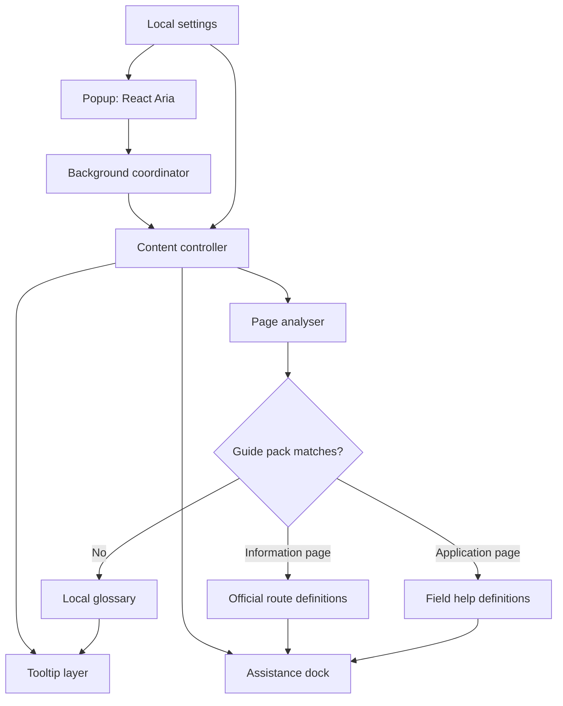

# Silver Guide 技術設計

## 1. 方針

Floorp で動作する Firefox 互換の WebExtension として、既存サイトの DOM を置き換えずに支援 UI を重ねる。拡張機能本体と、先行して作成した「やさしく読む」は別ディレクトリ・別 ID・別配布物にする。

最小権限を優先し、初期版は `activeTab`、`scripting`、`storage` を利用する。全ページで使えることは、広範な常時ホスト権限を要求することではなく、利用者が支援を開始した現在のタブで動作することとして実現する。

## 2. 構成



| 層 | 責務 | 入力値への扱い |
| --- | --- | --- |
| Popup | 開始・停止、文字サイズ、表示設定 | 扱わない |
| Background coordinator | 現在タブへの注入と状態メッセージ | 扱わない |
| Content controller | 支援 UI のライフサイクル、フォーカス連携 | 保存・送信しない |
| Page analyser | URL、公開された見出し・ラベル・フォーム構造を判定 | フィールド値を読まない |
| Tooltip layer | ローカル辞書の用語解説 | 本文の対象語句だけ |
| Assistance dock | 項目別ヒント・公式導線の表示 | フィールド値を表示しない |
| Guide pack | 確認済みサイトの公開構造と説明 | 値を定義・収集しない |

## 3. ページ支援の判定

1. ポップアップから利用者が支援を開始する。
2. Content controller がページの公開 URL と意味的な DOM 構造を取得する。
3. URL とページ構造が確認済みガイドパックに一致するときだけ、案内または申請の詳細モードを有効にする。
4. 一致しないときは、ローカル用語辞書と一般的なページ構造案内だけを有効にする。
5. 支援を停止すると、Silver Guide が追加したツールチップ・ドック・属性だけを確実に外す。

### 保守的な DOM 操作

- 本文の説明対象は段落、見出し、リスト、表の説明セルに限定する。
- `input`、`textarea`、`select`、`button`、`a`、`contenteditable`、`[role=application]`、埋め込みフレーム内は用語ラップの対象外とする。
- 支援 UI は Shadow DOM に隔離する。元サイトの CSS や JavaScript に影響を与えず、元の文章・属性・送信イベントを変更しない。
- 動的に追加される本文には `MutationObserver` で追従するが、処理対象を絞り、重いページでは支援を段階的に有効化する。

## 4. ガイドパック

ガイドパックは、特定の公開ページを検証したうえで追加するバージョン管理済みのデータである。行政サイトの深い支援は、必ずこの仕組みを経由する。

```ts
type GuidePack = {
  id: string;
  reviewedAt: string;
  matches: Array<{ origin: string; pathPattern: string; pageKind: "information" | "application" }>;
  glossary?: Array<{ term: string; plainExplanation: string }>;
  fields?: Array<{
    publicSelector: string;
    label: string;
    purpose: string;
    preparation: string[];
    nextPublicSelector?: string;
  }>;
  routes?: Array<{ label: string; officialUrl: string; context: string }>;
};
```

- `publicSelector` は、ページの公開済みの `id`、`name`、ラベル関係などから構成する。入力値は定義にも記録にも含めない。
- 対象サイトの改版を検知した場合は詳細支援を止め、共通の用語支援だけを残す。
- 公式 URL はガイドパックのレビュー時に確認する。生成 AI がその場で推測した URL を出さない。
- ガイドパックは初期版では拡張機能に同梱する。更新配信・リモート設定は、署名・レビュー・利用者への説明を設計してから追加する。

## 5. データと通信

| データ | 保存先 | 方針 |
| --- | --- | --- |
| 文字サイズ・表示設定 | `browser.storage.local` | 端末内だけに保存 |
| ローカル用語辞書 | 拡張機能に同梱 | 外部 API を使わない |
| ガイドパック | 拡張機能に同梱 | 公開ページの構造・説明だけ |
| フォーム入力値 | 保存しない | 読取・送信・ログ出力しない |
| 分析・利用計測 | 初期版は存在しない | 将来も明示同意が前提 |

## 6. 実装単位

```text
silver-guide-extension/
  public/manifest.json
  src/
    background/
    popup/
    content/
      controller/
      analyser/
      tooltip/
      dock/
    data/
      glossary/
      guide-packs/
    shared/
  docs/
```

- `popup/`: React Aria Components を用いた拡張機能ポップアップ。
- `content/`: ページ内の隔離 UI、ツールチップ、支援ドック。
- `data/glossary/`: すべてのページで使う、出典・レビュー日を持つ用語辞書。
- `data/guide-packs/`: サイト単位の公開構造・項目ヒント・公式導線。
- `shared/`: 型、設定、アクセシビリティ用のトークン、メッセージ契約。

## 7. テスト方針

1. **単体テスト**: 用語の一致、ガイドパックの URL 判定、対象外要素の除外、入力値を受け取らない型・関数を検証する。
2. **統合テスト**: 静的な行政案内・申請フォームのフィクスチャで、ツールチップ、ドック、次項目移動、停止処理を確認する。
3. **手動確認**: 対象となる公開行政ページの改版、キーボード、拡大文字、スクリーンリーダー、ページ崩れを確認する。
4. **プライバシー確認**: ストレージ、拡張機能メッセージ、ネットワーク、コンソールにフィールド値が出ないことを確認する。
