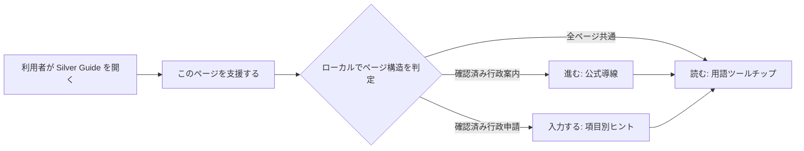

# Silver Guide プロダクト要件

## 1. 製品の位置づけ

Silver Guide は、実在するウェブページを置き換えず、そのページの横で理解と操作を支える Floorp 向け拡張機能である。対象はすべてのページとするが、最初の品質保証と機能の深さは行政関連の情報ページ・申請ページに集中する。

「すべてのページで使える」は、すべてのサイトで同じ深さの自動判断を約束する意味ではない。利用者が支援を開始したページで共通の用語解説を使え、確認済みの行政ページでは追加の入力・導線支援を使える、という段階的な意味である。

## 2. 利用者価値

1. 難しい言葉に出会っても、ページを離れずに短い説明を確認できる。
2. 申請フォームで「この欄に何を書くのか」「次にどこを見るのか」を迷わず確認できる。
3. 行政サイト内の関連手続き・公式案内へ、意味のある文脈で移動できる。
4. 支援を使っても、申請の判断・入力・送信の主体は利用者に残る。

## 3. 対象範囲

| ページ種別 | 初期提供する支援 | 深さ |
| --- | --- | --- |
| 一般の情報・案内ページ | 用語ツールチップ、文字サイズ、原文表示 | 共通機能 |
| 一般のフォーム | ラベル、必須表示、入力形式などページが公開している構造の読みやすい案内 | 共通機能 |
| 確認済みの行政案内ページ | 制度用語の解説、公式の関連手続き・窓口への導線 | 優先機能 |
| 確認済みの行政申請ページ | 項目別の意味、選択肢の説明、手順表示、次の項目へのフォーカス移動 | 優先機能 |

行政かどうかをドメイン名だけで推測しない。公開 URL とページ構造を検証したガイドパックに一致した場合だけ、行政向けの詳細支援を表示する。

## 4. 画面と利用の流れ

### 4.1 拡張機能ポップアップ

- 最初に見せる操作は常に **「このページを支援する」** の一つだけとする。
- 支援を開始した後で、現在のページで使える機能を「読む」「入力する」「進む」の言葉で表示する。
- 文字の大きさと「元の文章を表示」をいつでも変更できる。
- 「入力内容は送信しません」を常時読める位置に置く。

### 4.2 用語ツールチップ — 読む

- 対象語句にキーボードでフォーカスするか、クリック／タップすると開く。
- 表示内容は「用語」「短い言い換え」「必要な場合だけ公式案内への導線」「閉じる」で構成する。
- 本文の段落・見出し・リストだけを慎重に対象にする。リンク、ボタン、フォーム欄、編集領域、コード、埋め込みコンテンツは変更しない。
- 説明はローカルの用語辞書から表示する。初期版では外部の辞書 API を呼び出さない。

### 4.3 フォーム支援 — 入力する

- 確認済みの申請ページでのみ、現在フォーカスされている項目と対応するヒントを右側の支援ドックに表示する。
- ヒントは「この欄の目的」「何を確認してから書くか」「選択肢の意味」「次の項目へ」で構成する。
- 「次の項目へ」は次の公開済みフォーム項目へフォーカスを移すだけで、入力の完了判定や値の変更をしない。
- 一般フォームでは、ページ内に存在するラベル、必須表示、入力形式、説明文を読みやすく整理して表示する。制度固有の解釈や記入例は表示しない。

### 4.4 導線支援 — 進む

- 確認済みの行政案内ページで、現在の制度・手続きと対応する公式 URL を表示する。
- 遷移は利用者が押したときだけ行う。勝手にページを移動させない。
- ガイドパックにないサイトでは、ブラウザの標準ナビゲーションやページ内のランドマークを妨げない。

## 5. 非機能要件

### アクセシビリティ

- 本文は初期 18px 以上、見出し・主操作は 21px 以上とする。文字サイズは小・中・大を選べる。
- 主要な操作領域は 48px 以上を目安とし、アイコン単独の操作を避ける。
- キーボードだけで支援の開始、用語の展開、ツールチップを閉じる、フォームの次項目への移動ができる。
- 視覚上の選択・エラー・現在位置は、色だけでなく文言・枠線・読み上げでも伝える。
- `prefers-reduced-motion` を尊重し、不要な移動アニメーションを使わない。

### プライバシーと安全

- ページの支援は利用者の明示操作から開始し、対象タブにだけ注入する。
- 入力値、パスワード、認証情報、個人番号、口座番号、添付ファイル、送信結果を収集・記録・外部送信しない。
- 自動入力、自動選択、送信ボタンの実行、ログイン、本人確認、申請代行は実装しない。
- フォームの詳細ヒントは、入力値ではなく、公開されている項目名・ラベル・属性とガイドパックの定義だけに基づく。
- 利用状況の計測は初期版では行わない。将来導入する場合も、利用者の明示同意、目的の表示、いつでも無効化、入力内容を含まない集計を必須とする。

## 6. 初期版の受け入れ条件

1. 任意の通常ページで、支援開始後に対応語句のツールチップをキーボードとポインタの両方で開閉できる。
2. 対応していないページや動的なページでも、本文やフォーム操作を壊さず、支援を止められる。
3. 確認済みの行政申請ページで、公開済みの各対象項目に正しいヒントを表示し、次の項目へ安全にフォーカスを移せる。
4. 確認済みの行政案内ページで、ガイドパックに登録した公式 URL だけを導線として出せる。
5. ブラウザの開発者ツールで確認しても、フォーム値を拡張機能のストレージ、ログ、ネットワーク通信に残さない。
6. 支援ドック・ツールチップ・ポップアップを拡大文字とキーボード操作で利用できる。

## 7. 初期版で扱わないこと

- 行政機関の公式サイトや申請基盤そのものの改変
- 不確かな AI 推論による制度判定、資格判定、提出可否の回答
- 外部辞書 API への文章・入力内容の送信
- すべてのフォームに制度固有の記入支援を自動適用すること
- 自動送信、代理申請、本人確認の補助を超える操作
